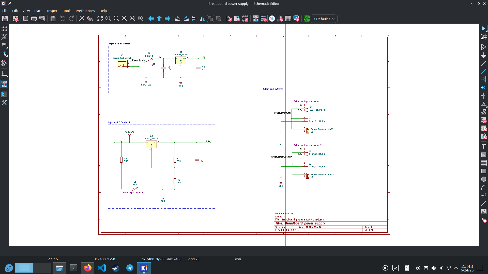
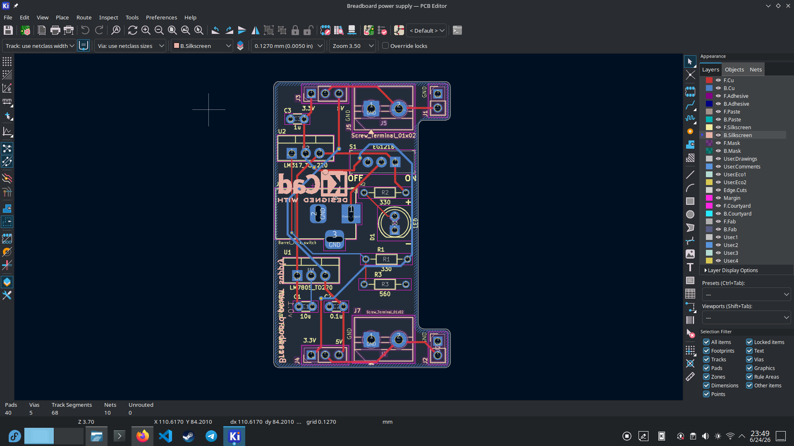
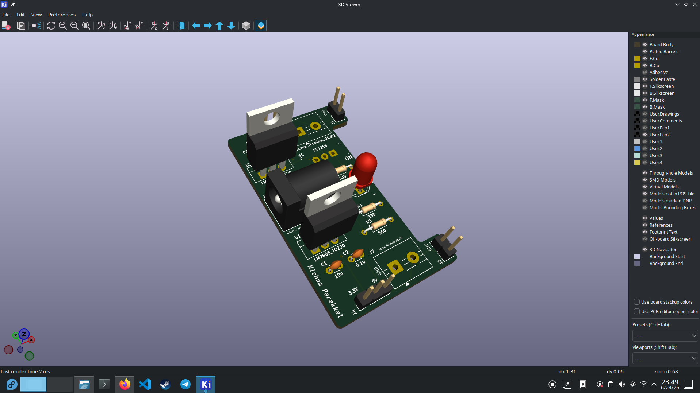

# Breadboard Power Supply

## Overview

A breadboard power supply designed in KiCad for electronics prototyping. The board provides both a fixed 5V output using an LM7805 regulator and an adjustable output using an LM317 regulator, making it suitable for powering a variety of breadboard-based circuits.

## Schematic

## PCB Layout

## 3D Viewer

